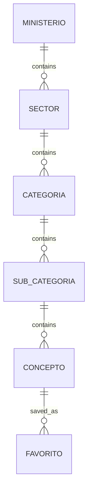

# Schéma de la base de données TaxasGE

Ce document décrit la structure de la base de données utilisée dans l'application TaxasGE.

## Modèle de données hiérarchique

L'application utilise un modèle de données hiérarchique à 5 niveaux :

1. **Ministerio** (Ministère) : Autorité gouvernementale principale
2. **Sector** (Secteur) : Domaine d'activité du ministère
3. **Categoria** (Catégorie) : Classification des services dans un secteur
4. **SubCategoria** (Sous-catégorie) : Subdivision optionnelle d'une catégorie
5. **Concepto** (Concept/Taxe) : Taxe spécifique avec ses montants et informations

## Structure des identifiants

Chaque niveau de la hiérarchie utilise un identifiant préfixé pour faciliter l'identification :

- Ministerio : `M-XXX` (ex: M-001)
- Sector : `S-XXX` (ex: S-001)
- Categoria : `C-XXX` (ex: C-001)
- SubCategoria : `SC-XXX` (ex: SC-001)
- Concepto : `T-XXX` (ex: T-001)

## Schéma des tables

### Table `ministerios`

| Colonne | Type | Description |
|---------|------|-------------|
| id      | TEXT | Identifiant unique du ministère (PK) |
| nombre  | TEXT | Nom du ministère |

### Table `sectores`

| Colonne      | Type | Description |
|--------------|------|-------------|
| id           | TEXT | Identifiant unique du secteur (PK) |
| ministerio_id| TEXT | Référence au ministère parent (FK) |
| nombre       | TEXT | Nom du secteur |

### Table `categorias`

| Colonne   | Type | Description |
|-----------|------|-------------|
| id        | TEXT | Identifiant unique de la catégorie (PK) |
| sector_id | TEXT | Référence au secteur parent (FK) |
| nombre    | TEXT | Nom de la catégorie |

### Table `sub_categorias`

| Colonne      | Type | Description |
|--------------|------|-------------|
| id           | TEXT | Identifiant unique de la sous-catégorie (PK) |
| categoria_id | TEXT | Référence à la catégorie parente (FK) |
| nombre       | TEXT | Nom de la sous-catégorie (peut être NULL) |

### Table `conceptos`

| Colonne             | Type | Description |
|---------------------|------|-------------|
| id                  | TEXT | Identifiant unique du concept/taxe (PK) |
| sub_categoria_id    | TEXT | Référence à la sous-catégorie parente (FK) |
| nombre              | TEXT | Nom du concept ou libellé de la taxe |
| tasa_expedicion     | TEXT | Montant de la taxe d'expédition |
| tasa_renovacion     | TEXT | Montant de la taxe de renouvellement |
| documentos_requeridos| TEXT | Documents nécessaires (peut être NULL) |
| procedimiento       | TEXT | Procédure à suivre (peut être NULL) |
| palabras_clave      | TEXT | Liste de mots-clés séparés par virgules |

### Table `favoritos`

| Colonne      | Type    | Description |
|--------------|---------|-------------|
| id           | INTEGER | Identifiant unique (PK, auto-incrémenté) |
| concepto_id  | TEXT    | Référence au concept/taxe (FK) |
| fecha_agregado| TEXT   | Date d'ajout aux favoris |

## Relations



## Avantages de cette structure

1. **Organisation claire** : La hiérarchie à 5 niveaux permet une organisation précise des taxes.
2. **Navigation intuitive** : Les utilisateurs peuvent parcourir la structure du plus général au plus spécifique.
3. **Recherche optimisée** : Les mots-clés et la structure hiérarchique facilitent la recherche.
4. **Extensibilité** : La structure permet d'ajouter facilement de nouvelles taxes ou catégories.

## Structure JSON vs Base de données SQLite

Le fichier JSON source utilise la structure suivante :

```json
[
  {
    "id": "M-001",
    "nombre": "MINISTERIO DE ASUNTOS EXTERIORES Y COOPERACIÓN",
    "sectores": [
      {
        "id": "S-001",
        "nombre": "SECTOR DE ASUNTTOS EXTERIORES Y COOPERACIÓN",
        "categorias": [
          {
            "id": "C-001",
            "nombre": "SERVICIO CONSULAR",
            "sub_categorias": [
              {
                "id": "SC-001",
                "nombre": null,
                "conceptos": [
                  {
                    "id": "T-001",
                    "nombre": "Legalización de Documentos",
                    "tasa_expedicion": "2 000",
                    "tasa_renovacion": "",
                    "documentos_requeridos": "",
                    "procedimiento": "",
                    "palabras_clave": "asunttos, consular, cooperación, documentos, exteriores, legalización, sector, servicio"
                  }
                ]
              }
            ]
          }
        ]
      }
    ]
  }
]
```

Cette structure hiérarchique imbriquée est normalisée dans la base de données SQLite pour permettre des requêtes efficaces et une gestion optimale des données.