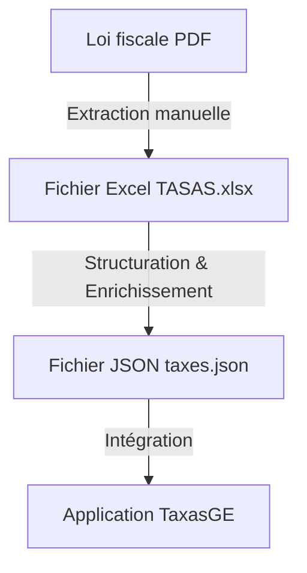
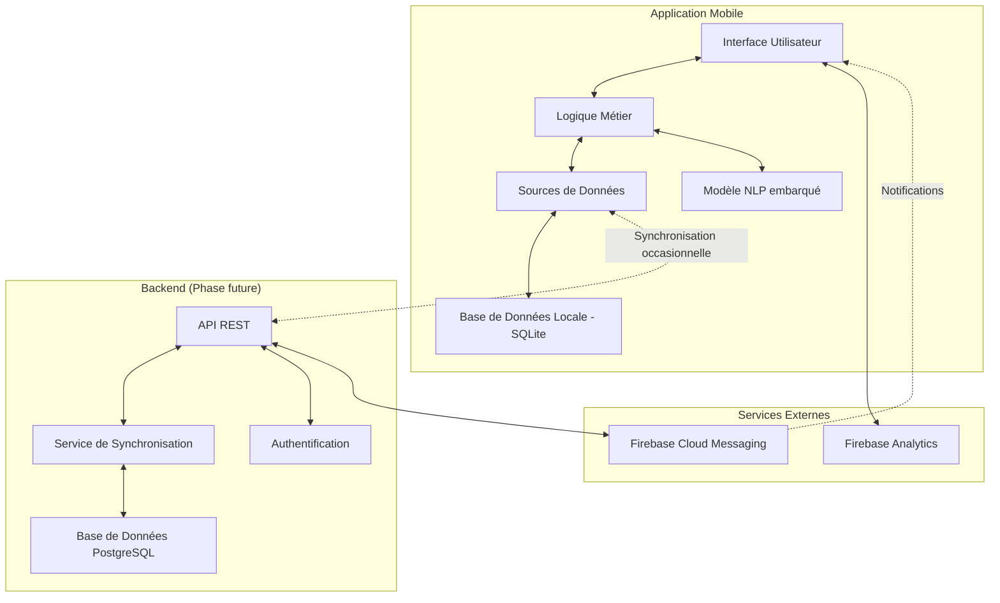
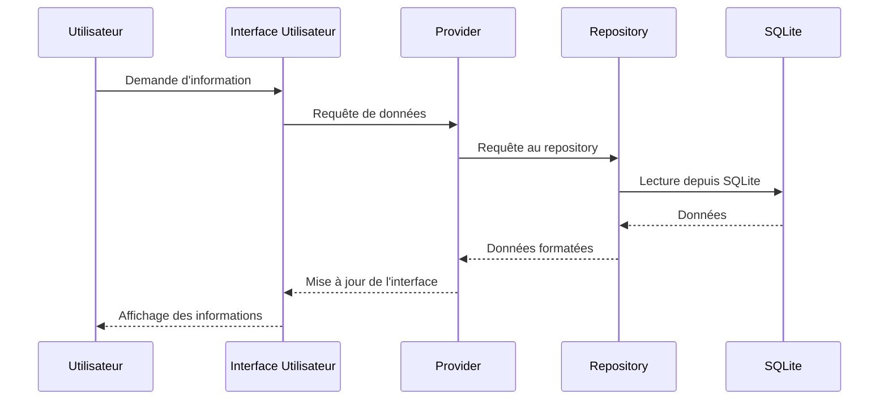
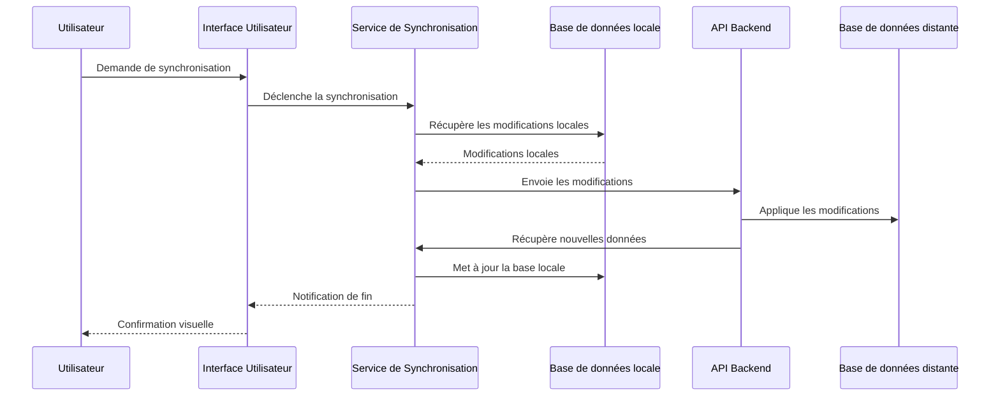
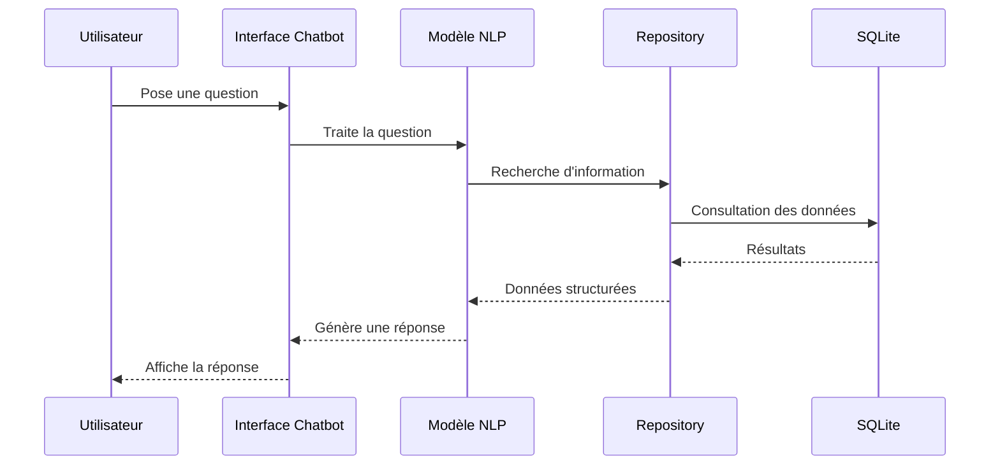
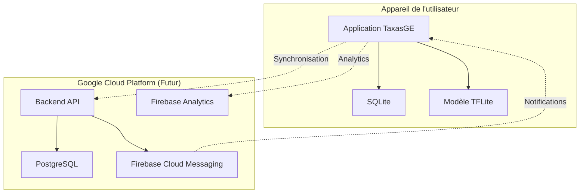

# Architecture Technique de TaxasGE

Ce document présente l'architecture technique complète de l'application TaxasGE, incluant tous les composants, leurs interactions et le flux de données.

## Vue d'ensemble

TaxasGE est une application mobile disponible sur iOS et Android qui permet aux citoyens, entreprises et administrations de Guinée Équatoriale de consulter facilement les taxes fiscales du pays. L'application est construite avec Flutter et fonctionne principalement en mode hors ligne.

## Processus de génération initial des données



### Description du processus

1. **Extraction depuis la loi fiscale** : Les données fiscales sont extraites manuellement du document PDF "LeydeTasasFiscales.pdf" et structurées dans le fichier Excel "TASAS.xlsx".

2. **Structuration des données** : Les données sont organisées selon la hiérarchie suivante :
   - Ministerio (Ministère)
     - Sector (Secteur)
       - Categoria (Catégorie)
         - SubCategoria (Sous-catégorie)
           - Concepto (Taxe)
   
3. **Enrichissement des données** : Les données sont enrichies avec des informations additionnelles :
   - Documents requis
   - Procédures
   - Mots-clés pour faciliter la recherche

4. **Génération du fichier JSON** : Les données structurées sont converties au format JSON "taxes.json" et intégrées dans l'application.

## Architecture de l'application



## Architecture en couches

L'application suit une architecture en couches claire :

### 1. Couche Présentation

Cette couche gère l'interface utilisateur et l'interaction avec l'utilisateur.

**Composants** :
- **Écrans** : Pages principales de l'application (accueil, recherche, détails, etc.)
- **Widgets personnalisés** : Composants UI réutilisables
- **Gestionnaires d'état** : Utilisation de Provider pour la gestion d'état

```dart
// Exemple simplifié d'un écran
class ConceptoDetailScreen extends StatelessWidget {
  final String conceptoId;
  
  @override
  Widget build(BuildContext context) {
    final concepto = Provider.of<ConceptoProvider>(context).getConceptoById(conceptoId);
    return Scaffold(
      appBar: AppBar(title: Text(concepto.nombre)),
      body: ConceptoDetailWidget(concepto: concepto),
    );
  }
}
```

### 2. Couche Domaine

Cette couche contient la logique métier et les modèles de données.

**Composants** :
- **Modèles** : Classes représentant les entités (ministerios, sectores, categorias, etc.)
- **Services métier** : Logique de traitement des données
- **Validateurs** : Validation des entrées utilisateur

```dart
// Exemple simplifié d'un modèle
class Concepto {
  final String id;                // Format: T-001
  final String nombre;
  final String tasaExpedicion;
  final String tasaRenovacion;
  final String documentosRequeridos;
  final String procedimiento;
  final String palabrasClave;
  
  // Constructeurs, méthodes, etc.
}
```

### 3. Couche Données

Cette couche gère l'accès aux données et leur persistance.

**Composants** :
- **Repositories** : Abstraction de l'accès aux données
- **Sources de données** : Accès aux données locales (SQLite) et distantes (API)
- **DAO (Data Access Objects)** : Objets d'accès aux données spécifiques

```dart
// Exemple simplifié d'un repository
class ConceptoRepository {
  final DatabaseHelper _dbHelper;
  
  Future<List<Concepto>> getAllConceptos() async {
    final db = await _dbHelper.database;
    final results = await db.query('conceptos');
    return results.map((json) => Concepto.fromJson(json)).toList();
  }
  
  Future<Concepto> getConceptoById(String id) async {
    // Implémentation...
  }
}
```

## Flux de données

L'application fonctionne selon trois modes principaux :

### 1. Mode hors ligne (Principal)



### 2. Mode synchronisation (Occasionnel)



### 3. Mode chatbot (Consultation assistée)



## Composants techniques détaillés

### Base de données locale (SQLite)

La structure de la base de données locale reflète le modèle de données hiérarchique à 5 niveaux :

```sql
-- Ministères
CREATE TABLE ministerios (
  id TEXT PRIMARY KEY,
  nombre TEXT NOT NULL
);

-- Secteurs
CREATE TABLE sectores (
  id TEXT PRIMARY KEY,
  ministerio_id TEXT NOT NULL,
  nombre TEXT NOT NULL,
  FOREIGN KEY (ministerio_id) REFERENCES ministerios (id)
);

-- Catégories
CREATE TABLE categorias (
  id TEXT PRIMARY KEY,
  sector_id TEXT NOT NULL,
  nombre TEXT NOT NULL,
  FOREIGN KEY (sector_id) REFERENCES sectores (id)
);

-- Sous-catégories
CREATE TABLE sub_categorias (
  id TEXT PRIMARY KEY,
  categoria_id TEXT NOT NULL,
  nombre TEXT,
  FOREIGN KEY (categoria_id) REFERENCES categorias (id)
);

-- Concepts (Taxes)
CREATE TABLE conceptos (
  id TEXT PRIMARY KEY,
  sub_categoria_id TEXT NOT NULL,
  nombre TEXT NOT NULL,
  tasa_expedicion TEXT NOT NULL,
  tasa_renovacion TEXT NOT NULL,
  documentos_requeridos TEXT,
  procedimiento TEXT,
  palabras_clave TEXT NOT NULL,
  FOREIGN KEY (sub_categoria_id) REFERENCES sub_categorias (id)
);

-- Favoris (pour les utilisateurs)
CREATE TABLE favoritos (
  id INTEGER PRIMARY KEY AUTOINCREMENT,
  concepto_id TEXT NOT NULL,
  fecha_agregado TEXT NOT NULL,
  FOREIGN KEY (concepto_id) REFERENCES conceptos (id)
);
```

### Modèle NLP embarqué

Un modèle TensorFlow Lite est utilisé pour l'assistant virtuel (chatbot) :

- **Type de modèle** : Modèle de question-réponse basé sur une architecture Transformer (version simplifiée)
- **Taille du modèle** : Optimisé pour les appareils mobiles (~10-15 MB)
- **Fonctionnalités** :
  - Compréhension des questions en langage naturel
  - Extraction d'informations pertinentes depuis la base de données
  - Génération de réponses en langage naturel

### Interface utilisateur

L'interface utilisateur est construite avec Flutter et suit les principes du Material Design :

- **Thème personnalisé** : Couleurs et typographie adaptées à l'identité visuelle
- **Navigation intuitive** : Structure hiérarchique reflétant l'organisation des données
- **Responsive design** : Adaptation aux différentes tailles d'écran
- **Mode hors ligne** : Indicateurs visuels de l'état de connexion

## Sécurité et performance

### Sécurité
- Les données fiscales sont disponibles publiquement et ne nécessitent pas de protection particulière
- Les favoris utilisateurs sont stockés localement, aucune donnée sensible n'est collectée

### Performance
- **Indexation optimisée** : Les colonnes fréquemment interrogées sont indexées
- **Chargement progressif** : Les données volumineuses sont chargées par lots
- **Mise en cache** : Les résultats de recherche fréquents sont mis en cache
- **Compression** : Les données textuelles sont compressées pour minimiser l'espace de stockage

## Extension future

Pour les phases futures du projet, l'architecture prévoit :

- **Backend API REST** : Pour la synchronisation des données et mises à jour
- **Service d'authentification** : Pour les fonctionnalités avancées et personnalisées
- **Notifications push** : Pour informer des changements dans les taxes
- **Analytics** : Pour analyser l'utilisation et améliorer l'expérience utilisateur

## Diagramme de déploiement



## Conclusion

Cette architecture technique permet à l'application TaxasGE de fonctionner efficacement en mode hors ligne tout en offrant des fonctionnalités avancées comme la recherche intelligente et l'assistant virtuel. L'organisation modulaire facilite l'évolution et la maintenance du code, tandis que l'approche en couches garantit une séparation claire des responsabilités.